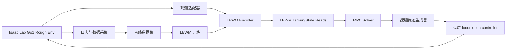

# Go1 基于 LEWM 与 MPC 的落脚点控制项目分析报告

**执行摘要：** 本报告按你给出的约束，将目标机器人明确设为 Go1，也就是由 entity["company","Unitree Robotics","robot maker"] 推出的四足平台；同时假定项目先在 Isaac Sim/Isaac Lab 上快速闭环验证，后续可能部署到真机。结论先说：**最快且风险最低的路线，不是让 LEWM 直接“端到端接管走路”，而是把 LEWM 定位成“感知—预测—代价建模”模块，再把落脚点决策交给一个显式可约束的 MPC，低层 locomotion 则复用现成控制器。** 原因很直接：官方 LeWM 当前是**纯像素、目标条件、CEM 动作优化**的世界模型，官方代码接口输出的是潜变量、预测 embedding 和 action-candidate cost，而不是腿式机器人落脚点、接触相位或可行域；反过来，Isaac Lab 已经提供了 Go1 的 flat/rough velocity 任务、joint-position action、height scanner、terrain curriculum、payload/base-mass randomization，以及导出 JIT policy 到 USD 场景推理的现成链路。对 MPC 部分，如果你要**最快 Python 集成**，首选 **OSQP** 或 **acados**；如果你要**更强的腿式机器人模型化能力**，首选 **OCS2 + HPIPM**，但要接受更重的 C++/ROS 工程成本。综合速度、鲁棒性和可解释性，我的**主推荐**是：**第一阶段先做“LEWM 预测局部地形/落脚点可行性 + OSQP/acados reduced-order MPC + 官方 Isaac Lab Go1 低层/PD 跟随”的方案；第二阶段再演进到“LEWM 候选落脚点 + OCS2/WBC”的硬约束方案。** citeturn30search0turn35view0turn34view1turn32view0turn37view0turn40view1turn40view0turn18search0turn28view0turn11view0turn11view1

## 项目定位与总体判断

你给出的机器人目标并不模糊：报告按 **Unitree Go1** 处理，不视为“未指定”。在基于 entity["company","NVIDIA","gpu company"] 生态的 Isaac Lab 当前主线中，官方环境注册表已经包含 `Isaac-Velocity-Flat-Unitree-Go1-v0` 和 `Isaac-Velocity-Rough-Unitree-Go1-v0` 两个任务，这一点非常关键，因为它意味着你不需要先自己搭 URDF/USD、观察空间和奖励函数，能直接把时间投入到世界模型与落脚点层。citeturn30search0

官方 Go1 rough 环境也给出了一个很好的“系统节拍”基线：环境基类设置 `sim.dt = 0.005`、`decimation = 4`，对应 **200 Hz 物理步进**与**50 Hz 策略更新**；height scanner 更新周期也是 `decimation * dt = 0.02 s`，即 **50 Hz**；contact sensor 以物理步进更新，即 **200 Hz**。同一配置里，Go1 rough 任务使用 **joint position action**，并把 `joint_pos.scale` 从基类 0.5 缩到 0.25，同时启用了 height scanner，缩放了 rough/boxes terrain 参数，并对 trunk/base mass 做了随机化。换句话说，官方基线已经天然适合你做“感知 + 负载 + 地形”研究，而不是只适合平地速度跟踪。citeturn35view0turn34view1turn32view0

所以这里的第一性判断是：**低层 locomotion 不应作为项目创新点**。低层要么直接复用 Isaac Lab 官方 Go1 rough policy，要么复用一个已经跑通 sim2real 的社区基线；你的研究重点应该放在三个接口上：**LEWM 如何消费感知输入、LEWM 如何产生对落脚点/MPC 有用的预测、MPC 如何把显式约束转成可跟随的轨迹/接触计划。** 这是最符合“快速集成并验证”的工程策略。citeturn30search0turn35view0turn37view0turn40view1turn18search0

## LEWM 的现状、能力边界与落脚点化改造

### 官方 LEWM 到底能直接给你什么

LeWM 的论文和官网都很清楚：它是一个 **end-to-end 的 JEPA 世界模型**，包括 encoder 和 predictor 两部分；encoder 把观测帧编码为低维潜变量，predictor 用动作条件去预测下一时刻潜变量。官方宣称模型规模约 **15M 参数**、可在**单 GPU 几小时**内训练完成；在其论文基准里，每帧被编码为**单个 192 维 token**，使用 CEM 做规划时，完整 planning 大约 **1 秒**，相对 DINO-WM 的 47 秒约快 **48 倍**。这些结论说明 LEWM **非常适合做轻量世界模型内核**，但并不自动意味着它已经适合腿式机器人落脚点控制。citeturn40view1turn40view0turn20academia20

官方实现的接口也很“研究原型化”：`encode(info)` 读取 `pixels`，可选读取 `action`，输出 `emb` 和 `act_emb`；`rollout(info, action_sequence)` 读取形如 `(B, S, T, action_dim)` 的 action candidates 做潜空间 rollout；`criterion()` 比较 `predicted_emb` 和 `goal_emb`；`get_cost()` 最终输出的是对 action candidates 的 cost。换句话说，**官方 LEWM 的标准输出不是落脚点候选，而是“候选动作序列到目标潜变量的代价”**。这和你要做的“基于地形与负载的显式落脚点控制”之间，隔着一层很大的腿式机器人特化改造。citeturn18search0turn16search0turn17search0

在训练/数据侧，LeWM 仓库直接建立在 stable-worldmodel 上。官方说明数据集以 **HDF5** 为主，按“每一列一个 dataset”的方式组织；训练通过 Hydra 配置驱动；示例数据加载会读取 `pixels`、`action`、`state` 等列。stable-worldmodel 本身支持数据采集、训练和 MPC 评估，并同时支持**在线评估**与**从离线数据集评估**，但 **LeWM 官方训练范式本质上仍是离线数据集训练**，并没有开箱即用的 continual online update 方案。也就是说：**离线训练是官方支持路径；在线训练/在线适应可以做，但属于你要补的工程。** citeturn15view0turn15view1turn14view2turn40view2turn40view3

### LEWM 在四足落脚点项目中的真实边界

最重要的一点是：LeWM 官网明确说明其规划过程**完全基于像素，不使用 proprioception**。而四足机器人落脚点控制最敏感的信息恰恰包括：机身姿态、COM 线速度/角速度、腿相位、接触状态、足端相对体坐标、关节极限、负载引起的等效惯量变化。官方 LEWM 没有为这些量设计标准输入头，也没有“足端着地可行性”或“接触时序”输出头。**如果你照搬官方 LeWM，不改接口，做出来的更像视觉 goal-conditioned planner，而不是可靠的 quadruped foothold controller。** citeturn40view1turn18search0

不过，世界模型用于腿式视觉运动并不是空想。由 entity["company","ByteDance","research org"] 研究团队发布的 WMP 已经证明：**在四足机器人视觉运动中，引入世界模型去预测未来感知，再让策略基于世界模型抽取的表征控制机器人，是有效且能 sim-to-real 的。** WMP 在 A1 机器人上报告了 real-world traversability 与 robustness 提升，并给出了公开代码；这说明**“世界模型 + 低层 locomotion”这条路线在腿式场景是成立的**，只是 LeWM 需要被重新接口化。citeturn23view0turn23view1turn23view2

### 针对 Go1 落脚点控制的 LEWM 改造建议

我建议把官方 LeWM 改成**两级输出**，而不是直接让它吐 joint action：

第一层是**状态/地形预测头**，输出一个 reduced-order 预测包，至少包含：

- 未来 \(H\) 步的机身状态占位：\(\hat{x}_{t+1:t+H} = [p, q, v, \omega]\)
- 未来接触相位占位：\(\hat{c}_{t+1:t+H} \in \{0,1\}^{4}\)
- 局部地形占位：局部 height patch / traversability patch / collision mask

第二层是**落脚点评分头**，直接对候选足端点集做打分：

\[
\mathcal{F}_t=\{(x_i,y_i,z_i)\}_{i=1}^{K}, \quad
s_i = g_\phi(z_t,\;f_i,\;\text{phase},\;\text{payload})
\]

最终给 MPC 的不是“LEWM 直接决定下一步踩哪”，而是：

- 候选落脚点集合 `K x 3`
- 对应可行性/风险分数 `K x 1`
- 未来 reduced-order state 预测
- 一个 uncertainty 标量或分位数，供 MPC 调整保守度

这样 LEWM 才真正成为“对 MPC 有用”的模块，而不是另一个 black-box planner。这个改造方向并非官方现成能力，而是**根据官方 LeWM I/O 形式反推出来的腿式接口化设计**。其合理性来自：LeWM 已经能输出 action candidate cost 与 latent rollout；你只需要把“goal latent cost”扩展为“foothold feasibility + state prediction + risk”即可。citeturn18search0turn16search0turn40view1

### LEWM 维度与约束清单

| 维度 | 官方 LEWM 现状 | 对 Go1 项目的解释 |
|---|---|---|
| 论文/实现 | LeWorldModel 论文、官网、官方仓库均已公开 | 可直接复现，但不是腿式专用 citeturn20academia20turn40view1turn40view2 |
| 输入格式 | `pixels`、`action`、可扩展 `state` 列；训练集 HDF5；`keys_to_load=['pixels','action','state']` 是官方示例 | 你应扩展到 `height_scan / base_state / joint_pos / joint_vel / contact_state / foot_pos / payload_mass` citeturn15view0turn16search0turn15view1 |
| 输出格式 | `emb`、`act_emb`、`predicted_emb`、action-candidate `cost` | 需要新增 `foothold_candidates` / `foothold_scores` / `pred_state` 头 citeturn18search0 |
| 训练数据 | 离线为主，数据录制与训练由 stable-worldmodel 支持 | 先离线训练；在线 fine-tune 放到二期 citeturn14view2turn40view2 |
| 推理延迟 | 官方给的是 planning 级别：约 1 秒的 CEM 规划，而不是毫秒级控制延迟 | 不应把官方 CEM 直接放进闭环控制；应改成“一次 encode，多次 head 推理”，交给 MPC 做实时优化 citeturn40view0 |
| 在线/离线 | 官方评估同时支持 online 和 offline-from-dataset；训练主路径仍是 dataset-based | 可在线采集、离线再训练；“持续在线学习”不是开箱即用 citeturn14view2turn15view1 |

## MPC 实现评估与推荐组合

### 可直接用的 MPC 库，按“快上手”到“强能力”排序

如果你的第一优先级是 **Isaac Lab 上快速集成**，我建议优先考虑下面三类：

**第一类是 OSQP 路线。** OSQP 官方直接提供了受状态/输入 box constraints 约束的线性 MPC 示例，并且 Python 接口支持自动 warm start，特别适合 **固定结构、reduced-order、线性或分段线性** 的足端力/落脚点 QP。它对不等式约束天然友好，接口也最容易从 Python 直接塞进 Isaac Lab step loop。缺点是：你得自己写 dynamics、condensing 或 sparse stacking，而且当模型进入明显非线性接触/姿态区间时，表达能力不如 NMPC。citeturn11view3turn27search2turn27search9

**第二类是 acados 路线。** acados 官方定位就是**快速、嵌入式、面向高频实时 NMPC/MHE**，有 Python 接口、支持 code generation，而且 OCP 中的 QP backend 可选 `PARTIAL_CONDENSING_HPIPM`、`PARTIAL_CONDENSING_OSQP` 等。这使它非常适合作为 Go1 项目的“中间形态”：你可以先用 Python 快速验证，再在确立模型后导出 C 代码，把 solver 搬进更轻的执行链。对你这种“先 Isaac Lab，后可能真机”的项目，acados 是非常平衡的选择。citeturn11view4turn12view0turn12view1turn27search3turn27search14

**第三类是 OCS2 + HPIPM 路线。** OCS2 本身就是面向机器人 real-time MPC 的 switched-systems toolbox，提供 SQP、iLQR、SLQ、IPM 等算法，支持用 Augmented Lagrangian 或 relaxed barrier 处理 path constraints，还给了 ROS 与 non-ROS 的 MPC/MRT 接口；HPIPM 则是它背后非常重要的结构化 QP 求解内核，可以处理 dense/OCP/tree-structured QP/QCQP，并支持 slack-based soft constraints。对于腿式机器人，这条路线的最大优势是：**已有大量 legged robot 先例，尤其适合显式接触约束与模型化 WBC/NMPC。** 最大缺点同样明显：工程最重。citeturn11view0turn11view1turn26view2turn26view3turn12view2turn12view3

Crocoddyl 也值得评估，但我把它放在**“trajectory optimization / 低频 receding horizon”**而不是第一优先。原因是它非常擅长 contact sequence 下的 DDP/FDDP 优化，支持 Python 绑定、Pinocchio、代码生成，Box-FDDP 也能处理 box-style control constraints；但它更像一个**优秀的最优控制/轨迹优化器**，而不是你这个项目里最省工程成本的在线足式 MPC 首选。它非常适合做**离线足端轨迹生成、warm start 生成器、或第二阶段高质量参考轨迹器**。citeturn11view2turn26view0turn26view1

如果只是做论文原型，do-mpc 也能用，因为它是完整的 Python NMPC toolbox，并且强调 robust MPC 与不确定性处理；但它更适合**快速原型**而不是 Go1 落脚点控制的最终实时栈。citeturn27search0turn27search15

### 对腿式机器人最有参考价值的公开经验

一篇 2025 年针对动态四足步行的 QP benchmark 直接给了你很实用的结论：其控制器按 **Gait Sequencer + MPC + Swing Leg Controller + WBC** 组织，**MPC 与 gait sequencer 运行在 100 Hz，SLC/WBC 运行在 500 Hz**；在不同求解器与稀疏/致密 QP 形式的比较里，作者结论是：**对 MPC 而言，稀疏求解器，尤其是基于 IPM 的 HPIPM，表现最好，更适合动态四足步行；而 WBC 部分，各开源求解器差异没那么关键，真正影响更大的是问题 formulation 本身。** 这对你的方案选择非常有指导意义：**把求解器心智预算放在 MPC，不要把大部分时间花在 WBC solver benchmarking 上。** citeturn28view0

另一个重要参照是 ETH 一系的 perceptive locomotion 栈：公开资料给出的核心节拍是 **NMPC 100 Hz，whole-body torque control 400 Hz**。这说明对于 Go1 这类平台，你完全可以把系统设计成：**LEWM/感知 20–50 Hz，MPC 50–100 Hz，低层跟踪 200–500 Hz**。这也是我后文接口建议会采用的频率框架。citeturn10search20

### 我对库选型的明确建议

| 选型 | 接口与维度 | 不等式约束 | QP/求解器选择 | 适合的 LEWM 耦合方式 | 我的判断 |
|---|---|---|---|---|---|
| **OSQP** | Python 最轻；适合 reduced-order 线性/分段线性模型，状态/控制维度你自己定义 | 强 | 原生 QP，自动 warm start | LEWM 输出 foothold score / risk / local terrain cost，MPC 直接做 QP | **最快 MVP**；推荐做一期 citeturn11view3turn27search2turn27search9 |
| **acados** | Python + codegen；适合 NMPC，后续可导出 C | 强 | `PARTIAL_CONDENSING_HPIPM`、`PARTIAL_CONDENSING_OSQP` 等 | LEWM 输出预测状态/约束参数，acados 处理非线性姿态与足端可达域 | **最平衡**；如果你想保留真机前景，这是首选 citeturn11view4turn12view0turn12view1turn27search14 |
| **OCS2 + HPIPM** | C++/ROS 或 non-ROS；对 switched contacts 最成熟 | 强 | SQP + HPIPM 等 | LEWM 作为 reference manager / cost updater / terrain module；MPC/MRT 接口现成 | **性能强但工程重**；适合二期或模型派路线 citeturn11view0turn11view1turn26view2turn12view2 |
| **Crocoddyl** | Python/C++ 都好；contact sequence TO 强 | 以 box constraints 更顺手 | FDDP/Box-FDDP | LEWM 先产出候选 footstep/reference，再用 Crocoddyl refine | **更像轨迹优化器/二级优化器** citeturn11view2turn26view0turn26view1 |
| **do-mpc** | Python 原型友好 | 强 | CasADi 驱动 | LEWM 作为 dynamics/cost 外部模块 | **适合实验，不是最终栈** citeturn27search0turn27search15 |

### 推荐的状态、控制、horizon 和 cost

对于 Go1 负载地形行走，我建议先从**reduced-order foothold MPC** 起步，而不是一开始全身 NMPC。原因是这样最容易先把 LEWM 插进去。

建议的最小状态：
\[
x = [p_{body}, q_{body}, v_{body}, \omega_{body}, p^{nom}_{foot,1:4}]
\]
如果做最简版，可以先只保留 \([p,q,v,\omega]\) 加一个下一步 swing-leg 目标落脚点。  
建议的最小控制：
\[
u = [f_{contact,1:4}, \Delta p^{next}_{foot}]
\]
也就是**支撑脚接触力**加**下一次摆腿的落脚点修正量**。

推荐初始 horizon：**0.3–0.5 s**，如果在 Isaac Lab 官方节拍上快速验证，就是 **50 Hz 控制下 15–25 步**，或者 **100 Hz 控制下 30–50 步**。这不是官方固定值，而是综合 Isaac Lab 的 50 Hz 低层任务节拍和腿式 MPC 文献常见 100 Hz 规划频率给出的工程建议。citeturn35view0turn28view0turn10search20

Cost 我建议至少包含五项：

1. **base tracking cost**：跟踪期望速度/姿态  
2. **foothold risk cost**：来自 LEWM 的候选点评分或风险  
3. **reachability cost**：落脚点相对 hip 的运动学/相位可达性  
4. **stability cost**：支撑多边形、ZMP/COM 裕量或躯干姿态波动  
5. **effort/slip cost**：接触力范数、切向力/法向力比、摆腿加速度

如果你用 OSQP，一期就把第 2 项做成**对候选足点的线性/二次惩罚**；如果你用 acados/OCS2，可以进一步把第 2/3/4 项做成更细的非线性 cost 或 inequality constraints。这个耦合方式比“LEWM 直接输出 footstep”更稳，因为它保留了 MPC 的约束可解释性。

## 低层 locomotion controller 备选对比

下面这张表专门按你要求比较**至少 3 个可直接用或可快速改用**的低层选项。我把“直接用”和“值得借用”分开看待：你若只追求最快闭环，首选官方 Go1；你若更在意 sim2real pipeline 或模型式跟踪，再考虑后面的选项。

| 选项 | 是否开箱可用 | Isaac Lab 兼容性 | 输出动作类型 | 接口易用性 | payload / terrain randomization | 源码位置与许可证 | 我的判断 |
|---|---|---|---|---|---|---|---|
| **Isaac Lab 官方 Go1 rough velocity** | 高 | **原生** | **关节位置目标** | 高：官方 train/play/JIT→USD 推理链完整 | 高：height scan、terrain curriculum、base-mass randomization、external force、观测噪声 | 官方 Isaac Lab；BSD-3-Clause | **最佳基线，也是我最推荐的一期低层** citeturn30search0turn35view0turn34view1turn32view0turn37view0 |
| **MRSS2025 Go1 Challenge** | 中高 | **原生** | 关节位置型 RL（继承 Isaac Lab Go1 locomotion 栈，属工程推断） | 高：Go1 特定项目结构清晰，含 train/play/teleop/autonomous-nav 模板 | 中高：取决于你继承的 Isaac Lab env 配置 | 社区仓库；仓库页未明确给出许可证类型 | **很好的 Go1 项目骨架，适合直接改造成你的实验仓库** citeturn41view0turn30search0 |
| **basic-locomotion-isaaclab** | 中高 | **原生 Isaac Lab 扩展** | 关节空间 RL 控制（基于其 Isaac Lab locomotion 扩展，属工程推断） | 中高：包含 sim2sim、sim2real、ROS2、RMA/CSE 等全套研究特性 | 高：强调参数辨识、RMA、sim2real | 社区仓库；BSD-3-Clause | **如果你想要更研究化的 RL 低层与 sim2real 工具链，这个比从零搭更快** citeturn7view0 |
| **walk-these-ways** | 中 | **非原生，需要从 Isaac Gym 迁移/适配** | README 未直接写明；作为 Go1 RL locomotion controller，可作“joint-space black-box 低层”看待 | 中：Go1 训练/仿真/部署资料成熟，但不是 Isaac Lab | 高：PPO、domain randomization、MoB、真机部署 | 官方仓库；README 说明继承原始代码许可证，但未在仓库摘要中直接明示总许可证 | **非常适合做 teacher / 对照基线，不适合做 Isaac Lab 首版主干** citeturn7view3turn39search4 |
| **legged_gym** | 中 | **旧框架；官方已建议迁移到 Isaac Lab** | 传统 legged RL 低层；更适合做参考而不是新项目主干 | 中：社区资料很多，但新功能将有限维护 | 高：friction & mass randomization、noisy observations、random pushes、actuator network | 官方仓库；含 License 文件，且官方已指向 Isaac Lab 迁移路径 | **经典参考系，不建议作为新项目主仓库** citeturn7view4 |
| **legged_control / Quadruped_Wrapper** | 低到中 | **非原生，需要 ROS/Gazebo/桥接** | **WBC / NMPC 力矩型控制路径** | 低：工程重量大，但模型式接口清晰 | 中高：可接 blind/perceptive controller，适合显式约束 | `legged_control` 为 BSD-3-Clause，`Quadruped_Wrapper` 为 MIT；后者面向 Unitree quadrupeds | **如果你最终必须“硬约束每一步落脚点”，这条路线最像二期产品化方案；但它不适合作为一期最快验证路径** citeturn25view0turn25view1 |

表中的核心结论很简单：**一期先用 Isaac Lab 官方 Go1 rough velocity；二期如果需要严格落脚点约束，再往 OCS2/WBC 方向切。** `walk-these-ways` 与 `legged_gym` 更适合提供**性能上限、teacher policy、奖励设计参考、randomization 清单**；`basic-locomotion-isaaclab` 则适合借它的 sim2real pipeline；`legged_control` 适合做“硬约束第二阶段”。citeturn7view0turn7view3turn7view4turn25view0turn37view0

## 系统架构、接口与仿真循环

### 推荐模块划分

我建议项目拆成六个模块：

1. **Isaac Lab 环境层**：Go1 rough velocity + custom payload/terrain curriculum  
2. **观测适配层**：把 Isaac Lab 的原始观测整理成 world-model 输入  
3. **LEWM 编码/预测层**：输出 terrain/state latent、风险、候选足点  
4. **MPC 层**：根据 LEWM 输出与 reduced-order 模型做落脚点优化  
5. **轨迹/摆腿层**：把 footstep plan 变成 swing trajectory 与机身参考  
6. **低层 locomotion 层**：官方 Go1 RL policy、PD，或二期的 WBC/NMPC

这个划分的关键优点是：**LEWM 和 MPC 可以单独 ablation**，而低层 controller 可以替换，最大化复用现有代码。其时间基准建议参考 Isaac Lab 官方 Go1 节拍与当前四足 MPC 公开实践：**Sim/contact 200 Hz，height-scan 50 Hz，LEWM 20–50 Hz，MPC 50–100 Hz，低层 50–500 Hz。** 其中 50 Hz 是 Isaac Lab 官方 rough locomotion 的天然基线，100/400–500 Hz 则与当前腿式 MPC/WBC 实践一致。citeturn35view0turn32view0turn28view0turn10search20



### 建议接口定义

下面是我建议的接口，不是官方协议，但它能很好地兼容 Isaac Lab 与后续真机部署。

| 消息 | 生产者 | 消费者 | 频率 | 字段建议 |
|---|---|---|---|---|
| `ObsPacket` | Isaac Lab | LEWM / MPC | 50 Hz 主观测；contact 200 Hz 可单独缓存 | `t, base_pose[m,quat], base_vel[m/s,rad/s], joint_pos[rad], joint_vel[rad/s], foot_pos_base[m], foot_contact[0/1], cmd_vel[m/s,rad/s], height_scan[m], payload_mass[kg]` |
| `LatentPacket` | LEWM encoder | MPC / logger | 20–50 Hz | `z_t[float32,D], uncertainty, terrain_patch_feat` |
| `FootholdPacket` | LEWM head | MPC | 20–50 Hz | `candidates[K,3](m), scores[K], sigma[K], phase_id[4]` |
| `MpcPlanPacket` | MPC | swing generator / low-level | 50–100 Hz | `next_footsteps[4,3](m), contact_schedule[H,4], base_ref[H,*], swing_clearance[m]` |
| `LowLevelCmd` | swing generator / policy wrapper | Isaac Lab / hardware bridge | 50 Hz（RL）或 200–500 Hz（PD/WBC） | `joint_pos_target[rad]` 或 `joint_tau[Nm]` |

Isaac Lab 官方 rough locomotion 配置已经定义了 `base_lin_vel`、`base_ang_vel`、`projected_gravity`、`velocity_commands`、`joint_pos_rel`、`joint_vel_rel`、`last_action`、`height_scan` 这些 observation term，并使用 joint-position action，这使上述 `ObsPacket` 基本可以零成本映射。citeturn34view1turn34view3

### 训练/仿真循环

推荐的闭环是：

- **阶段一：低层基线固定**  
  使用 Isaac Lab 官方 Go1 rough policy 或基于其配置训练的低层策略，只采集地形、payload、foot-contact、body-state 数据。  
- **阶段二：离线训练 LEWM**  
  先做“terrain/state prediction + foothold feasibility”监督或自监督混合训练。  
- **阶段三：MPC 融合**  
  先在 open-loop 回放数据上验证 LEWM score 与真实 foothold success 的相关性，再接上 OSQP/acados 做 closed-loop。  
- **阶段四：端到端闭环**  
  在 Isaac Lab 中同时启用 payload randomization、terrain curriculum、外力扰动，测成功率与鲁棒性。  

LeWM 官方仓库本身就是通过 stable-worldmodel 走“采集数据—训练—MPC 评估”闭环的；而 Isaac Lab 官方又已经给了 JIT policy 导出与 USD 场景推理示例。因此，这个训练循环和现有工具链是对齐的。citeturn15view1turn14view2turn37view0

### sim-to-real 注意事项与建议的 randomization 列表

Isaac Lab 官方 Go1 rough 配置与 legged_gym/walk-these-ways 的共同经验都指向同一个事实：**你必须把“payload、地形不确定性、外力扰动、观测噪声”视为一等公民。** 官方 Go1 rough 已经随机化 trunk/base mass、外力、terrain geometry，并加入了观测噪声；legged_gym 则强调 friction/mass randomization、noisy obs、random pushes；walk-these-ways 则把 domain randomization 与多行为控制作为核心特性。citeturn32view0turn34view1turn7view4turn7view3

我建议你的一期 randomization 清单至少包括：

- terrain：台阶高度、stone spacing、rough noise amplitude、坡度  
- contact：摩擦系数、恢复系数、地面局部 patch 变化  
- robot：payload mass、payload 位置、trunk COM、腿部等效惯量  
- actuation：电机强度缩放、控制延迟、PD gain 漂移、action clip  
- sensing：IMU 偏置、height-scan 噪声、深度/高度丢点、时间戳抖动  
- disturbances：水平推力、yaw 扰动、落地冲击  

其中前四类大部分都已有现成先例；后两类是为了未来真机而强烈建议补上的工程项。citeturn32view0turn34view1turn7view4turn7view3

## 集成方案与里程碑

### 方案一

**LEWM 直接输出落脚点候选/风险 → MPC 生成落脚点与机身参考 → WBC/PD 跟随**

这是“控制味道最正”的方案。LEWM 输出 `K` 个候选 footstep 与其风险分数，MPC 显式决定下一步落脚点、接触时序与 base trajectory，低层由 swing-foot generator + PD/WBC 去执行。它最适合你真的要研究**落脚点策略本身**，因为 footstep 在优化器里是显式变量，不是隐含在 RL policy 里。MPC 推荐用 **acados** 或 **OCS2 + HPIPM**；如果你愿意先牺牲一点模型精度，用 OSQP 也能做一期 reduced-order 版本。citeturn11view4turn11view0turn12view2turn28view0

它的主要优点是：  
**可解释、可加约束、footstep error 可量化、后续真机价值高。**  
主要缺点是：  
**低层执行器要自己写得更细，尤其是你如果不用现成 WBC，而是用 PD/IK 跟随，调参量会明显变大。**

建议实现步骤：

1. 固定 Isaac Lab Go1 rough 环境，先只记录数据，不改低层  
2. 训练 LEWM foothold-score head 与 reduced-order state head  
3. 写 reduced-order MPC，先只优化 `next foothold + base vel tracking`  
4. 接 swing trajectory generator  
5. 最后再评估是否有必要上 WBC

建议关键参数：

- candidate footholds：每条 swing leg 每周期 8–24 个  
- MPC horizon：0.3–0.5 s  
- LEWM update：20–50 Hz  
- MPC solve：50–100 Hz  
- swing clearance：0.04–0.08 m 起步  
- payload curriculum：0 kg → 1 kg → 2 kg 等级推进

建议测试指标：

- traversal success rate  
- foothold placement error  
- slip rate  
- body roll/pitch RMS  
- specific mechanical cost / torque sum  
- commanded velocity tracking error  
- average MPC solve time 与 99th percentile solve time

时间估计：**如果已有 Isaac Lab Go1 baseline，可在 4–6 周拿到像样的一期结果；若直接做 OCS2/WBC，通常要拉到 6–8 周。**

### 方案二

**LEWM 预测局部 terrain / traversability / reduced-order state → heuristic 候选生成 → MPC 或 heuristic 选点 → 官方 Isaac Lab Go1 低层策略跟随**

这是我最推荐的**一期项目方案**。它不要求 LEWM 直接生成 footstep，只要求它给出**“哪里危险、哪里可踩、未来短时状态会怎么演化”**。之后用启发式候选生成器在局部地图上枚举候选足点，再交给 OSQP/acados 选出一个，并把它转成对低层可消费的参考信号。低层如果继续使用官方 Isaac Lab Go1 RL policy，则你需要把**“下一步期望 foothold / local traversability cue”**注入 observation；如果低层只肯接 `cmd_vel`，则把 footstep plan 先降维成短时 base command 修正量。citeturn35view0turn34view1turn37view0turn11view3turn11view4

它的主要优点是：  
**改动最小、可以大量复用现成 low-level、训练与控制可以解耦。**  
主要缺点是：  
**落脚点往往是“软提示”而不是“硬约束”，因此理论上不如方案一干净。**

建议实现步骤：

1. 直接跑通官方 Go1 rough 训练/导出/在 USD 中推理  
2. 在 observation adapter 中加入 payload、height_scan、contact cache  
3. 训练 LEWM 的 terrain-risk/state head  
4. 写一个 heuristic candidate generator  
5. 用 OSQP 选点，先只管下一步 single-swing leg  
6. 把选点结果转成低层 observation augmentation 或短时 velocity correction

建议关键参数：

- traversability patch：以 body 为中心 0.8 m × 0.6 m  
- candidate set：每腿 12–16 个  
- LEWM latent dim：先继承官方 192 token 路线  
- MPC horizon：先做 1-step 到 5-step lookahead  
- low-level policy 保持 50 Hz，不先改

建议测试指标：

- 成功率  
- 摔倒率  
- payload 增加时性能下降曲线  
- roughness 等级上的泛化曲线  
- foot collision / stumble 次数  
- 低层策略对高层提示的敏感性

时间估计：**2–4 周拿到首个闭环演示是现实的。**

### 两个方案怎么选

如果你的目标是**最快做出能跑的视频和可发表的 ablation**，先做 **方案二**。  
如果你的目标是**把“落脚点控制”本身做成真正的控制问题，而不是感知提示问题**，再进入 **方案一**。  

我的明确建议是：  
**先 B，后 A。**  
B 解决“世界模型到底有没有信息增益”；A 解决“如何把信息增益变成可约束的最优控制收益”。

## Codex 实现任务清单

### 建议仓库结构

下面这套结构的目的，是让你能把环境、LEWM、MPC、低层适配和评测完全拆开：

```text
go1_lewm_mpc/
├── exts/go1_lewm_mpc/
│   ├── config/
│   │   ├── env/go1_lewm_rough.yaml
│   │   ├── lewm/train.yaml
│   │   ├── mpc/osqp_foothold.yaml
│   │   └── mpc/acados_foothold.yaml
│   ├── data/
│   │   ├── dataset_schema.py
│   │   └── replay_buffer.py
│   ├── envs/
│   │   ├── go1_env_wrapper.py
│   │   └── obs_adapter.py
│   ├── world_model/
│   │   ├── lewm_backbone.py
│   │   ├── foothold_head.py
│   │   ├── state_head.py
│   │   └── trainer.py
│   ├── mpc/
│   │   ├── osqp_centroidal.py
│   │   ├── acados_foothold.py
│   │   ├── cost_terms.py
│   │   └── constraints.py
│   ├── controllers/
│   │   ├── swing_traj.py
│   │   ├── low_level_policy_wrapper.py
│   │   └── pd_tracker.py
│   ├── eval/
│   │   ├── metrics.py
│   │   ├── benchmark_payload.py
│   │   └── benchmark_terrain.py
│   └── tests/
│       ├── test_obs_adapter.py
│       ├── test_dataset_schema.py
│       ├── test_lewm_heads.py
│       ├── test_osqp_mpc.py
│       └── test_closed_loop_smoke.py
└── scripts/
    ├── collect_dataset.py
    ├── train_lewm.py
    ├── export_low_level_policy.py
    ├── run_closed_loop.py
    └── eval_closed_loop.py
```

### 建议按 PR 切分

**PR-A：跑通官方 Go1 rough baseline 与 policy export**  
目标是验证环境、训练脚本、checkpoint、JIT/export、USD 推理这一整条链。这个 PR 只做环境与低层，不碰 LEWM 与 MPC。官方 Isaac Lab 已经给出 RL 脚本入口和 USD 推理教程，因此这是最低风险的第一步。citeturn36view0turn37view0

**PR-B：数据采集器与 schema**  
实现 `collect_dataset.py`，把下列字段写成 HDF5 或 Parquet/HDF5 混合缓存：

```python
obs = {
    "pixels_front": np.uint8[H, W, 3],
    "height_scan": np.float32[Nh],
    "base_pose": np.float32[7],
    "base_vel": np.float32[6],
    "joint_pos": np.float32[12],
    "joint_vel": np.float32[12],
    "foot_pos_base": np.float32[4, 3],
    "foot_contact": np.int8[4],
    "cmd_vel": np.float32[3],
    "payload_mass": np.float32[1],
    "action": np.float32[12],
}
```

这里的字段设计是对 stable-worldmodel/LeWM 的 `pixels + action + state` 形式做腿式扩展。官方 LeWM/stable-worldmodel 已经证明这种“列式 dataset + sequence loader”工作流是成立的。citeturn15view0turn15view1turn40view2

**PR-C：LEWM backbone 接入与两个 task head**  
实现两个明确的函数接口：

```python
def encode_obs(batch: dict[str, torch.Tensor]) -> dict[str, torch.Tensor]:
    """
    Input:
        pixels_front: [B, T, C, H, W]
        height_scan:  [B, T, Nh]
        base_state:   [B, T, 13]
        action:       [B, T, 12]
    Output:
        {
            "latent": [B, T, D],
            "terrain_feat": [B, T, Dt],
            "dyn_feat": [B, T, Dd],
        }
    """
```

```python
def predict_footholds(latent: torch.Tensor, phase: torch.Tensor) -> dict[str, torch.Tensor]:
    """
    Output:
        {
            "candidates": [B, K, 3],   # m, in base frame
            "scores": [B, K],          # higher is safer
            "sigma": [B, K],           # uncertainty
        }
    """
```

```python
def predict_state(latent: torch.Tensor, horizon: int) -> torch.Tensor:
    """
    Output:
        pred_state: [B, H, Nx]
    """
```

**PR-D：OSQP foothold MPC 原型**

下面给一个足够可执行的最小调用骨架。它不是完整控制器，但已经把接口关系说明白了：

```python
import osqp
import numpy as np
import scipy.sparse as sp

class FootholdMPC:
    def __init__(self, P, A, q, l, u):
        self.prob = osqp.OSQP()
        self.prob.setup(P=P, q=q, A=A, l=l, u=u, warm_start=True, verbose=False)

    def solve(self, q_new, l_new, u_new):
        self.prob.update(q=q_new, l=l_new, u=u_new)
        res = self.prob.solve()
        if res.info.status_val not in (1, 2):
            raise RuntimeError(f"OSQP failed: {res.info.status}")
        return res.x
```

OSQP 官方文档已经给出线性约束 MPC 与 warm start 支持，因此这个 PR 完全可以先做 reduced-order 版本，不需要等全身动力学准备好。citeturn11view3turn27search2turn27search9

**PR-E：acados 版本的 NMPC 备胎**  
如果你不想被 OSQP 的线性模型绑住，就补上 `acados_foothold.py`，让它接收：

- `x0`
- `ref_traj`
- `foothold_candidates`
- `foothold_scores`
- `payload_params`

输出：

- `next_foothold`
- `contact_forces`
- `base_ref`

acados 的 Python OCP 接口与 codegen 路线对这个用例是天然成立的。citeturn27search3turn27search14

**PR-F：低层适配器**

```python
@dataclass
class LowLevelCommand:
    joint_pos_target: np.ndarray  # [12]
    joint_vel_target: np.ndarray  # [12]
    torque_ff: np.ndarray         # [12]

def mpc_plan_to_joint_targets(plan, robot_state) -> LowLevelCommand:
    # 1. 生成 swing foot Bezier
    # 2. 逆运动学到 joint_pos_target
    # 3. 支撑相保持姿态/速度参考
    ...
```

如果你一期坚持复用官方 Isaac Lab 低层 RL，则 `low_level_policy_wrapper.py` 的任务是把 `MpcPlanPacket` 降维成它能消费的 observation augmentation 或 velocity bias，而不是直接把 footstep 塞给一个原本没定义 footstep command 的 policy。这一步虽然是工程设计，但关系到方案二能否跑通。

### 配置文件建议

```yaml
# config/mpc/osqp_foothold.yaml
horizon: 10
dt: 0.02
n_candidates_per_leg: 12
weights:
  track_base_vel: 10.0
  foothold_risk: 6.0
  foothold_reach: 4.0
  effort: 0.1
constraints:
  max_step_x: 0.18
  max_step_y: 0.12
  min_clearance: 0.045
  friction_coeff: 0.6
  payload_margin_scale: 1.25
```

```yaml
# config/lewm/train.yaml
sequence_length: 16
latent_dim: 192
history_size: 3
num_preds: 1
use_pixels: true
use_height_scan: true
use_proprio: true
heads:
  foothold:
    num_candidates: 16
  state:
    pred_horizon: 10
loss:
  foothold_ce: 1.0
  foothold_rank: 0.5
  state_l2: 1.0
  sigreg: 0.1
```

### 单元测试与仿真验证用例

必须单测的点：

- `test_obs_adapter.py`：Isaac Lab raw obs → `ObsPacket` 的字段与单位正确  
- `test_dataset_schema.py`：序列切片时不会错位；payload 与 action 对齐  
- `test_lewm_heads.py`：`predict_footholds()` 输出 shape 与范围稳定  
- `test_osqp_mpc.py`：无解、边界约束、warm start 更新  
- `test_closed_loop_smoke.py`：10 秒仿真内不崩溃、不 NaN、不越界  

必须跑的仿真验证 case：

- flat + 0 kg  
- rough + 0 kg  
- rough + 1 kg  
- stepping stones + 1 kg  
- stairs + 2 kg  
- push disturbance + rough + 1 kg  

这些 case 的原因不是形式化，而是它们正对应 Go1 rough terrain、payload、外力与 foothold precision 的关键维度。

### 优先参考来源

如果要给 Codex 一个“先查哪里”的最短清单，我会这样排：

- **Isaac Lab 官方文档与 Go1 任务源码**：Go1 任务注册、rough env 配置、RL 脚本、USD policy inference。citeturn30search0turn35view0turn34view1turn32view0turn36view0turn37view0  
- **LeWM 官方论文、官网、源码**：核心能力、I/O、数据与训练入口。citeturn20academia20turn40view1turn18search0turn16search0turn40view2  
- **stable-worldmodel**：数据格式、MPC 评估、在线/离线 protocol。citeturn15view1turn14view2turn14view0  
- **OCS2 / acados / HPIPM / OSQP 官方文档**：MPC 主干实现。citeturn11view0turn11view1turn11view4turn12view0turn12view1turn12view2turn11view3turn27search2  
- **四足领域参考项目**：WMP、basic-locomotion-isaaclab、walk-these-ways、legged_control。citeturn23view0turn23view1turn7view0turn7view3turn25view0turn25view1  

## 下一步具体动作

1. **跑通官方 Go1 rough baseline，并导出可在 USD 场景推理的低层 policy**  
   预估工时：**6–8 小时**  
   交付物：训练日志、checkpoint、导出的 `policy.pt`、在自定义场景中跑起来的视频。

2. **实现 Go1 数据采集管线，生成首批 HDF5 序列数据集**  
   预估工时：**10–14 小时**  
   交付物：`collect_dataset.py`、dataset schema、至少 200–500 条 episode，覆盖 flat/rough/payload 三类场景。

3. **先做一个不依赖 LEWM 的 OSQP reduced-order foothold MPC stub**  
   预估工时：**12–16 小时**  
   交付物：`osqp_centroidal.py`、可在 replay 数据上跑通的候选落脚点选择与 solve-time profiling。

4. **把官方 LEWM backbone 接进项目，先训练 terrain/state head，不急着端到端出足点**  
   预估工时：**16–24 小时**  
   交付物：`lewm_backbone.py`、`state_head.py`、`foothold_head.py`，以及第一版 offline validation 指标。

5. **完成首个闭环实验：rough terrain + payload 下，比较“无 LEWM / 有 LEWM 提示”的成功率与 slip rate**  
   预估工时：**12–18 小时**  
   交付物：对照实验脚本、结果表、视频与初版 ablation 图。