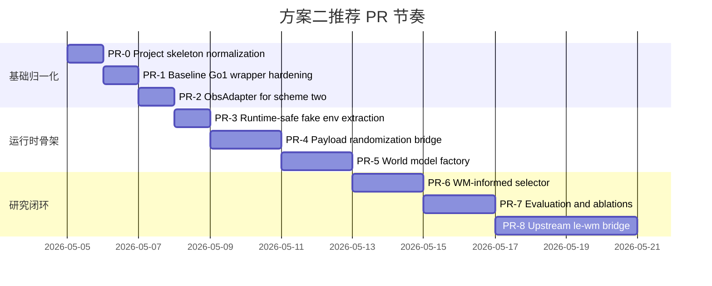

# Elbow_corl 仓库深度调研报告

## 执行摘要

该仓库托管在 entity["company","GitHub","software platform"]，目标是围绕 entity["company","Unitree Robotics","robotics company"] Go1 与 entity["company","NVIDIA","semiconductor company"] Isaac Lab / Isaac Sim 构建一个“粗糙地形 + 负载 + LEWM 世界模型 + OSQP 落脚点选择 + 低层策略 cue 注入”的 Phase 1 原型。就**代码现状**看，它已经不再是一个空壳：README、目录树、关键模块、脚本和测试都表明，仓库已经具备了 `Go1EnvWrapper`、`ObsAdapter`、HDF5 数据采集、`WorldModelBase`/`DummyLEWM`、`LEWMAdapter`、候选落脚点生成、OSQP 选择器、cue 注入、闭环 smoke runner 和评测脚本等一整套骨架。换句话说，`CODEX_TASK_QUEUE.md` 中很多标成 `TODO` 的任务，其实已经在主代码树中落地了，只是**任务队列没有同步更新**。citeturn5view0turn16view0turn16view1turn16view2turn16view3turn16view4turn16view5turn16view6turn15view1turn18view1

但如果目标不是“Phase 1 smoke test 能跑”，而是要把这个仓库**真正推进到 Go1 + IsaacLab + 上游 le-wm + WM-informed MPC foothold scheme（方案二）**，当前最重要的判断是：**仓库已经完成了大部分脚手架，却还没有完成最关键的“真实上游世界模型接桥”和“实验可复现的 payload / ablation / benchmark 闭环”**。最核心的缺口有五个：其一，根目录没有生效版 `AGENTS.md` / `CODEX_TASK_QUEUE.md`，现有 agentic workflow 文件被放在 `go1_codex_agentic_pack/` 下，且队列状态仍是全 `TODO`；其二，`run_closed_loop.py` 只允许 `--world_model dummy`，`LEWMAdapter` 没有真正接入闭环主路径；其三，官方 le-wm 是**基于像素的 JEPA + predictor + CEM planning**，而当前仓库的 `LEWMAdapter` 假设的是 `ObsPacket -> predict_risk/predict_state` 的局部风险 API，这两者在输入、输出和训练契约上存在根本不匹配；其四，`eval_closed_loop.py` 已有评估框架，但 mode/ablation 仍不完整，并且直接从 `go1_lewm_mpc.tests.fixtures` 导入 `FakeIsaacEnv`，把测试依赖拉进了运行时代码；其五，`TASKS.md` 期望的 `payload_randomization.py` 和 `profile_mpc.py` 仍缺失，导致“payload robustness”与“solver latency”这两个方案二里很重要的实验支柱还没有真正工程化。citeturn16view11turn18view0turn35view3turn38view0turn38view1turn27view8turn37view1turn37view2turn36view0turn30search0turn32view3turn32view4turn32view5turn32view6

我的总体结论很明确：**这个仓库适合作为 Codex 的“增量改造底座”，不适合当成“从零开始的任务队列”直接照着跑。** 如果直接把当前 `CODEX_TASK_QUEUE.md` 当真，Codex 很可能会在已经实现的模块上重复施工；如果直接把当前 `LEWMAdapter` 当成“已经完成上游 le-wm 集成”，那后面会在接口契约上踩大坑。正确做法应当是：先做一轮**项目骨架归一化**，把 agentic 规则提到仓库根目录、更新队列状态、抽掉运行时代码对 tests fixture 的依赖；然后再按“小 PR、mock-first、把真实 IsaacLab 依赖推迟到最后验证”的方式，逐步把世界模型桥接、payload 注入、2D terrain patch 观测、WM-informed cost 和 ablation 评测补齐。citeturn37view3turn37view4turn37view5turn37view6turn27view8turn38view1turn25view6turn25view7

## 仓库现状与已有能力

从仓库结构看，主包 `go1_lewm_mpc` 已经分成 `common`、`envs`、`data`、`world_model`、`foothold`、`mpc`、`controllers`、`eval` 和 `tests` 等子模块；配置目录则包含 `env`、`eval`、`lewm`、`mpc` 四组 YAML；测试目录下已有 12 个 pytest 文件，覆盖 types、wrapper、adapter、dataset、DummyLEWM、LEWMAdapter mock、候选生成、OSQP 选择、cue 注入、官方策略 wrapper、闭环 smoke 和 metrics。这说明作者已经不是在“写设计文档”，而是在“维护一个可测试的原型系统”。citeturn16view0turn16view1turn16view2turn16view3turn16view4turn16view5turn16view6turn16view7turn16view8turn15view1turn16view7turn16view8

`pyproject.toml` 和 `requirements.txt` 也暴露了一个很重要的事实：仓库把自身定义为 `go1-lewm-mpc`，依赖只显式列出 `numpy`、`scipy`、`h5py`、`pyyaml`、`tqdm`、`matplotlib`、`osqp` 和 `pytest`，**没有 pin Isaac Lab、torch、rsl_rl 或 Isaac Sim 版本**。这意味着当前仓库默认把 Isaac Lab、TorchScript policy、GPU 驱动都视为“外部环境前提”，而不是仓库自带依赖。对 agentic coding 来说，这既是优点也是风险：优点是 mock-first 很干净；风险是**版本不确定性被推迟到了集成阶段**。citeturn33view0turn33view1turn37view6turn18view3

README 给出的架构路径相当清楚：`Isaac Lab Go1 rough env -> ObsAdapter -> LEWM / DummyLEWM -> terrain risk and short-horizon prediction -> heuristic candidate generation -> OSQP or heuristic foothold selection -> velocity bias / observation cue -> official Go1 locomotion policy`。README 还逐段说明了 baseline runner、ObsAdapter、dataset collector、DummyLEWM、LEWMAdapter、候选点生成、OSQP selector、cue injection、closed-loop smoke runner 和 evaluation 的用法，这与目录树和测试文件是一致的。它不是一份理想化蓝图，而是对现有实现的描述。citeturn5view0

在 Isaac Lab / Go1 集成上，`Go1EnvWrapper` 已经做了两件很对的事情。第一，它把 Isaac Lab 导入和 Omniverse 启动延后到 `reset()` / `step()`，避免模块导入时就触发模拟器；第二，它直接围绕 `parse_env_cfg(..., device="cuda:0", num_envs=...)` 和 `gymnasium.make(task_name, cfg=env_cfg)` 封装，并在 GUI 模式下把 viewer 对准机器人 asset root。它还试图兼容 `isaaclab_tasks.utils` 和旧命名 `omni.isaac.lab_tasks.utils`，这说明作者已经意识到 Isaac Lab 命名空间在不同版本之间存在差异。citeturn14view0turn14view1turn28view2turn28view3turn28view4turn28view5turn41view0turn41view1turn41view2turn41view3

在低层控制器集成上，仓库没有尝试“让 LEWM 直接出 12 维关节动作”，而是做了一个很合理的工程选择：`OfficialGo1PolicyWrapper` 读取导出的 TorchScript `policy.pt`，并在 `compute_action()` 中尝试把 command correction 注入策略输入；如果注入失败且 `strict_cue=True`，就明确抛错，而不是静默退回 baseline。这和 `AGENTS.md` 里“不要让 LEWM 直接控制所有关节、不要静默降级”的规则是一致的。citeturn14view5turn25view8turn41view4turn41view5turn37view1turn37view2

在世界模型与落脚点规划上，仓库已经把骨架搭齐了：`WorldModelBase` 规定了 `encode / predict_risk / predict_state` 接口；`DummyLEWM` 带有 `safe_radius_m`、`max_radius_m`、`max_z_error_m`、`payload_conservative_gain`、`terrain_roughness_gain` 等配置，并给出有限风险与常速度未来状态；`RiskMap` 只是对 world model 的风险输出做形状/有限性检查；`FootholdCandidateGenerator` 生成落在可达椭圆区域里的候选；`OSQPFootholdSelector` 做小型 OSQP 参考问题求解，失败时退回 heuristic fallback，并把状态写进 `plan.debug`；`foothold_to_velocity_bias()` 和 `make_low_level_cue()` 把 foothold 计划变成 clipped velocity bias。就 Phase 1 角度看，这一套已经具备基本闭环能力。citeturn24view4turn24view3turn25view3turn25view4turn24view2turn24view0turn24view1turn14view4turn25view5turn24view5turn24view6turn41view6turn41view7

但仓库在 **“真实 LEWM 集成”** 这件事上，现状只到“mockable adapter”，没到“upstream bridge”。当前 `LEWMAdapter` 的说明非常直接：checkpoint 契约刻意做得很小，可以支持 metadata-only mock checkpoint、linear heads 和 risk MLP；丢失 learned heads 时，用本地 deterministic terrain/proprioceptive features 兜底；`train_lewm.py` 非 `--dry_run` 直接抛 `NotImplementedError`。这代表当前代码的立场其实是“先把 call site 固定下来，再等未来接入真实模型”，而不是“已经接好了真实 le-wm”。citeturn5view0turn14view3turn25view6turn25view7turn28view10turn28view11turn27view9

更重要的是，上游 le-wm 官方资料清楚表明它是**像素输入**的 LeWorldModel：由 encoder 和 predictor 组成，训练数据是 HDF5，训练入口在 `train.py`/`jepa.py`/Hydra configs 下，评估时是把起始图像和目标图像编码到 latent，再用 CEM 优化动作序列；官方网站还特别强调“LeWM plans purely from pixels, with no proprioceptive information used at any stage.” 这和当前仓库的 `ObsPacket`、`predict_risk(obs, query_points_b)`、`predict_state(obs, horizon, dt)` 是两套完全不同的接口假设。当前仓库更接近“本地定义了一个 foothold-risk world model API”，而不是“直接对接上游 le-wm 原始规划栈”。citeturn30search0turn32view3turn32view4turn32view5turn11view0turn25view6turn25view7

## 任务完成度判定

### 任务队列完成度

下表按 `go1_codex_agentic_pack/CODEX_TASK_QUEUE.md` 的 Task 001–012 逐项判定当前主代码树的真实完成度。这里的关键点不是“文档写了什么”，而是“代码仓库已经有哪些模块、脚本与测试”。citeturn18view1turn34view0turn35view3

| 任务 | 队列目标 | 当前判定 | 依据 |
|---|---|---|---|
| Task 001 | skeleton、dataclass、常量、README、`.gitignore`、`test_types.py` | **已实现** | `pyproject.toml`、`requirements.txt`、`README.md`、`.gitignore`、`common/types.py`、`common/constants.py`、`common/math_utils.py` 和 `test_types.py` 均已存在。citeturn33view0turn33view1turn39view0turn11view0turn11view1turn11view2turn15view1 |
| Task 002 | `Go1EnvWrapper` + `run_baseline.py` + mock tests | **已实现** | `envs/go1_env_wrapper.py`、`scripts/run_baseline.py`、`test_go1_env_wrapper_mock.py` 已存在，且 wrapper 使用 lazy import 与 mock loader 测试。citeturn16view0turn19view0turn14view0turn14view1turn28view3turn28view4turn26view0turn27view0 |
| Task 003 | `ObsAdapter` + fake fixtures + `test_obs_adapter.py` | **已实现** | `ObsAdapter.from_isaac()`、fallback 策略、fixtures 和测试均已存在。citeturn14view2turn28view6turn28view7turn28view8turn40view0turn19view1 |
| Task 004 | HDF5 schema、writer/loader、`collect_dataset.py` | **部分实现** | schema / writer / loader / collector 都在；但 collector 固定从 `env_id=0` 取样，本质上没有把 `num_envs` 扩展成并行 episode 采集，而且 payload runtime 注入模块仍缺。citeturn16view2turn24view9turn24view10turn27view2turn27view3turn36view0 |
| Task 005 | `WorldModelBase` + `DummyLEWM` | **已实现** | base 接口、DummyLEWM、terrain/state heads、测试均已存在。citeturn16view3turn24view4turn24view3turn25view3turn25view4turn15view1 |
| Task 006 | gait/phase + candidate generator + risk map | **已实现** | `PhaseEstimator`、`FootholdCandidateGenerator`、`RiskMap` 及其测试均已存在。citeturn24view1turn24view0turn24view2turn19view2 |
| Task 007 | OSQP selector + robust fallback | **已实现** | `OSQPFootholdSelector.select()`、cost/constraints 段和 fallback 测试都已存在。citeturn14view4turn25view0turn25view1turn25view2turn21view1 |
| Task 008 | cue injection + low-level wrapper | **已实现** | `cue_injection.py`、`command_filter.py`、`LowLevelPolicyWrapper` 和测试都已存在。citeturn16view1turn24view5turn24view6turn41view6turn41view7turn15view1 |
| Task 009 | dummy closed loop、baseline/no-cue/cue 三模式 | **部分实现** | `run_closed_loop.py` 与 `ClosedLoopMetrics` 存在，三种 mode 可通过 `use_mpc/use_cue` 组合表达；但实际 `--world_model` 只允许 `dummy`，而且没有真实 LEWM backend。citeturn26view2turn27view4turn27view6turn38view0turn38view1turn24view7 |
| Task 010 | repeatable evaluation、metrics.csv/summary.json/config.yaml | **部分实现** | `eval_closed_loop.py`、scenario modules、metrics 和 `benchmark.yaml` 都在；但 modes 只覆盖 baseline/no-cue/cue/dummy_lewm，尚未形成 queue 里要求的更完整 heuristic / real LEWM / ablation 体系。citeturn16view6turn17view1turn25view10turn38view2turn38view3turn38view4 |
| Task 011 | real LEWM adapter | **部分实现** | `LEWMAdapter` 已有类、缺 checkpoint 报错、CUDA->CPU fallback 和 mock test；但 `train_lewm.py` 仍未实现训练，闭环主路径也没有真实选择该 backend。citeturn14view3turn28view10turn28view11turn27view9turn15view1turn38view0 |
| Task 012 | clean ablation modes | **缺失** | queue 要求 `heuristic_only / lewm_risk / lewm_risk_no_payload / lewm_risk_no_height` 与 `ablation_summary.csv`；当前 `_mode_flags()` 只支持 baseline / no-cue / cue / dummy_lewm，也没有专门的 ablation summary。citeturn35view3turn38view3turn38view4 |

### AGENTS 规则符合度

`AGENTS.md` 不是摆设，当前仓库对它的符合度会直接影响 Codex 的执行质量。整体上，懒加载 Isaac Lab、mock-first tests、禁止 LEWM 直接出 12D joint actions 这几条做得不错；但“根目录 agentic 规则缺位”“运行时代码引用 tests fixture”“队列状态不更新”这几条，会让 agentic coding 很容易跑偏。citeturn37view0turn37view1turn37view2turn37view3turn37view4

| AGENTS 规则 | 当前判定 | 说明 | 依据 |
|---|---|---|---|
| Core data 用 dataclass 传递 | **符合** | `ObsPacket`、`LatentPacket`、`FootholdCandidatePacket`、`MpcPlanPacket`、`LowLevelCue` 都已定义并在模块间使用。 | citeturn11view0turn37view1 |
| Isaac Lab import 必须 lazy | **符合** | wrapper 明确把启动推迟到 `reset()/step()`，mock tests 不要求 Isaac Lab。 | citeturn14view0turn14view1turn19view0turn37view6 |
| 每个实现任务都要有 tests/mock tests | **基本符合** | 仓库已有 12 个测试文件，覆盖面比较广。 | citeturn15view1 |
| 未实现 mode 不要静默降级 | **部分符合** | `train_lewm.py` 用 `NotImplementedError` 是对的；但闭环主入口仍只接受 `dummy` backend，eval 的 unsupported mode 抛的是 `ValueError` 而不是按 AGENTS 要求显式的 `NotImplementedError`。 | citeturn27view9turn38view0turn38view3turn37view2 |
| 依赖方向清晰、不要把 tests 依赖带入运行时 | **不符合** | `eval_closed_loop.py` 直接 import `go1_lewm_mpc.tests.fixtures.FakeIsaacEnv`，把测试包变成生产脚本依赖。 | citeturn27view8turn37view1 |
| 小 PR、读任务、只做当前任务 | **不符合现状** | 任务队列仍写着 `TODO`，但主仓库代码已经跨过了多个任务阶段；对 Codex 来说，这个 queue 已经过时。 | citeturn18view1turn34view0turn35view3 |

## 面向方案二的缺口与代码变更清单

这里我只列**真正会阻塞 Go1 + IsaacLab + 上游 le-wm + MPC foothold scheme** 的缺口，而不是泛泛而谈的“还能改进什么”。优先级按 P0 / P1 / P2 给出；LOC 和工时是为 Codex 小 PR 估算的，不是人工重构的极限值。所有“签名 / 配置键”都是**建议的、可落地的最小改动面**。这些建议是基于当前代码、`TASKS.md` 结构、`AGENTS.md` 约束、Isaac Lab 官方运行方式、上游 le-wm 输入契约，以及 OSQP 官方 MPC 示例共同推出来的。citeturn36view0turn37view1turn37view2turn32view0turn32view1turn30search0turn32view3turn32view6

| 优先级 | 缺口 | 需要修改的文件 | 建议签名 / 配置键 | 估算 LOC | 估算工时 | 判定理由 |
|---|---|---|---|---:|---:|---|
| P0 | 根目录 agentic 规则缺位，队列状态陈旧 | `AGENTS.md` **新增**；`CODEX_TASK_QUEUE.md` **新增/更新**；`CODEX_PROMPTS.md` **新增/更新**；`README.md` **修改** | 无运行时接口；把当前 `go1_codex_agentic_pack/` 内容提升到根目录，并把 Task 001–008 标为 DONE、009–011 标为 PARTIAL、012 标为 TODO | 80–140 | 0.5 天 | 当前规则文件只在子目录，且 queue 仍是全 `TODO`，会误导 Codex 重复实现已完成模块。citeturn16view11turn18view0turn18view1turn35view3 |
| P0 | 运行时代码依赖 tests fixture | `go1_lewm_mpc/mock/fake_isaac_env.py` **新增**；`scripts/eval_closed_loop.py` **修改**；`go1_lewm_mpc/tests/fixtures.py` **修改** | `class FakeIsaacEnv:`、`def make_fake_raw_obs(...)` 移到 runtime-safe mock 模块；tests 再从这个 mock 模块导入 | 60–100 | 0.5 天 | `eval_closed_loop.py` 当前直接 import `go1_lewm_mpc.tests.fixtures.FakeIsaacEnv`，这是最该先修的工程卫生问题。citeturn27view8turn37view1 |
| P0 | Payload 方案没有运行时注入桥 | `go1_lewm_mpc/envs/payload_randomization.py` **新增**；`go1_env_wrapper.py`、`collect_dataset.py`、`run_closed_loop.py`、`eval_closed_loop.py`、`configs/env/go1_lewm_rough.yaml` **修改** | 建议新增 `@dataclass class PayloadSpec(mass_kg: float, com_b: np.ndarray)`；`class PayloadRandomizer: def apply(self, env, spec, env_ids=None) -> None`；配置新增 `payload.enabled`, `payload.mass_kg`, `payload.com_b`, `payload.randomize`, `payload.range_kg`, `payload.range_com_b` | 180–260 | 1–2 天 | `TASKS.md` 明确期望 `payload_randomization.py`，而 benchmark config 已经出现 `rough_1kg / rough_2kg / stairs_1kg` 等场景，但当前 envs 目录中并没有 payload 模块。citeturn36view0turn16view0turn17view1 |
| P0 | `run_closed_loop.py` 只支持 `dummy` world model | `scripts/run_closed_loop.py` **修改**；`go1_lewm_mpc/world_model/factory.py` **新增**；`configs/lewm/train_lewm.yaml`、`README.md` **修改** | `def build_world_model(cfg: dict) -> WorldModelBase`；CLI 新增 `--world_model {dummy,lewm}`、`--world_model_ckpt`、`--world_model_cfg` | 120–220 | 1–1.5 天 | 当前 parser 的 `choices=("dummy",)` 已经把真实 backend 路堵死了。citeturn38view0turn38view1 |
| P0 | 当前 `LEWMAdapter` 不是上游 le-wm 真桥接 | `go1_lewm_mpc/world_model/lewm_adapter.py` **重构**；`go1_lewm_mpc/world_model/upstream_lewm_bridge.py` **新增**；`scripts/train_lewm.py`、`configs/lewm/train_lewm.yaml` **修改** | 建议扩成 `class LEWMAdapter(WorldModelBase): __init__(self, checkpoint_path: str, cfg: dict, device="cuda", backend="mock", input_key="height_scan", upstream_repo=None, risk_head_ckpt=None)`；配置新增 `world_model.backend`, `world_model.input_key`, `world_model.upstream_repo`, `risk_head.path`, `freeze_encoder` | 350–600 | 3–5 天 | 官方 le-wm 是“pixel->latent->predictor->CEM”，而当前 adapter 是“ObsPacket->risk/state”；不加桥接层就谈不上真实集成。citeturn30search0turn32view3turn32view4turn32view5turn25view6turn25view7 |
| P0 | `ObsAdapter` 还没为上游 le-wm 准备稳定的 2D terrain patch | `go1_lewm_mpc/envs/obs_adapter.py` **修改**；`go1_lewm_mpc/tests/fixtures.py`、`test_obs_adapter.py` **修改**；`configs/env/go1_lewm_rough.yaml` **修改** | 保持 `ObsPacket.height_scan` 不变，但约定支持 `[Nh]` 与 `[H,W]` 两种形态；新增配置 `obs.height_scan_mode`, `obs.heightmap_size`, `obs.heightmap_extent_m`, `obs.heightmap_source` | 150–240 | 1–1.5 天 | 当前 adapter 已接受 `height_scan`，但要对接像素/heightmap 型 LeWM，需要把 2D terrain patch 约定固化并加测试。citeturn11view0turn14view2turn28view6turn40view0turn30search0 |
| P0 | Selector 目前是 risk+reach 的 one-step QP，不是真正 WM-informed MPC | `go1_lewm_mpc/mpc/osqp_foothold.py`、`cost_terms.py`、`constraints.py`、`scripts/run_closed_loop.py`、`test_osqp_foothold.py` **修改** | 建议把签名扩为 `select(..., risk: np.ndarray, pred_state: np.ndarray | None = None, uncertainty: float | None = None) -> MpcPlanPacket`；配置新增 `weights.state_terminal`, `weights.uncertainty`, `horizon_steps`, `warm_start` | 180–320 | 1.5–2.5 天 | 当前闭环完全没有调用 `predict_state()`，这更像 heuristic foothold QP，不是“世界模型 + MPC”。citeturn25view4turn14view4turn38view1turn32view6 |
| P1 | Evaluation 模式与 queue / AGENTS 不一致 | `scripts/eval_closed_loop.py`、`configs/eval/benchmark.yaml`、`go1_lewm_mpc/eval/metrics.py` **修改** | 支持 `baseline`, `heuristic_only`, `dummy_lewm_risk`, `lewm_risk`, `lewm_risk_no_payload`, `lewm_risk_no_height`；未实现模式改为 `NotImplementedError`；输出新增 `ablation_summary.csv` | 180–260 | 1–2 天 | queue 的 Task 010/012 要求更完整的评测与 ablation，当前 `_mode_flags()` 还停在 baseline/no-cue/cue/dummy_lewm。citeturn35view3turn38view3turn38view4turn37view2 |
| P1 | `train_lewm.py` 只有 dry-run，没有最小训练回路 | `scripts/train_lewm.py`、`configs/lewm/train_lewm.yaml`、`tests/test_lewm_adapter_mock.py` **修改** | 建议最小落地为“冻结上游 encoder，仅训练 risk probe / state probe”，入口例如 `def train_risk_head(cfg: dict) -> Path` | 250–500 | 2–4 天 | 当前脚本只是配置校验器，不足以支撑“真实 LEWM adapter”的生命周期。citeturn27view9turn14view3 |
| P2 | 缺少 MPC profiling 工具 | `scripts/profile_mpc.py` **新增**；`README.md` **修改** | `python scripts/profile_mpc.py --num_trials 1000 --config configs/mpc/osqp_foothold.yaml` | 80–140 | 0.5–1 天 | `TASKS.md` 结构里明确列了 `profile_mpc.py`，但仓库尚无此工具。citeturn36view0 |
| P2 | Official policy artifact 获取路径不完整 | `README.md` 或 `docs/policy_export.md` **新增**；可选 `scripts/export_policy_stub.py` **新增** | 文档化 `rsl_rl/play.py` / JIT export 流程；配置新增 `policy.checkpoint_path` | 60–120 | 0.5 天 | 当前 wrapper 明确要求 `policy.pt`，但仓库缺少从 Isaac Lab / RSL-RL 获取该 artifact 的工程说明。citeturn14view5turn25view8turn32view1turn31search8 |

### 建议的配置增量示例

下面这个 YAML 片段不是对现有配置的机械复述，而是我建议为“方案二 + 上游 le-wm 桥接”增加的最小配置面。它保留当前仓库的 `height_scan` / `payload` / `mpc` 思路，同时给上游像素型 LeWM 留出接入位。该建议是基于当前 `ObsPacket`、现有 YAML、README 闭环路径和官方 le-wm 输入契约的推导。citeturn11view0turn17view0turn17view3turn17view4turn30search0turn32view3

```yaml
obs:
  height_scan_mode: heightmap2d
  heightmap_size: [64, 64]
  heightmap_extent_m: [0.8, 0.5]
  heightmap_source: raycast

payload:
  enabled: true
  randomize: true
  mass_kg: [0.0, 3.0]
  com_b_z_m: [0.02, 0.08]

world_model:
  backend: upstream_lewm
  input_key: height_scan
  checkpoint_path: checkpoints/lewm_backbone.ckpt
  risk_head_ckpt: checkpoints/lewm_risk_head.ckpt
  freeze_encoder: true

mpc:
  horizon_steps: 4
  weights:
    risk: 1.0
    reach: 0.25
    state_terminal: 0.5
    uncertainty: 0.2
```

### 建议的 fake ObsPacket fixture

为了让 Codex 在没有 Isaac Lab 和 GPU 的环境里依然能推进 PR，下面这个 fake fixture 结构是值得固定下来的。它和仓库现有 `ObsPacket` 契约兼容，但把 `height_scan` 明确成了二维 heightmap，从一开始就为上游 le-wm 桥接留输入位。citeturn11view0turn40view0turn34view7

```python
import numpy as np
from go1_lewm_mpc.common.types import ObsPacket

def make_fake_obs_packet_2d() -> ObsPacket:
    return ObsPacket(
        t=0.0,
        base_pos_w=np.array([0.0, 0.0, 0.32], dtype=np.float32),
        base_quat_wxyz=np.array([1.0, 0.0, 0.0, 0.0], dtype=np.float32),
        base_lin_vel_w=np.array([0.3, 0.0, 0.0], dtype=np.float32),
        base_ang_vel_w=np.zeros(3, dtype=np.float32),
        joint_pos=np.zeros(12, dtype=np.float32),
        joint_vel=np.zeros(12, dtype=np.float32),
        foot_pos_b=np.array([[0.20, 0.12, -0.30],
                             [0.20, -0.12, -0.30],
                             [-0.20, 0.12, -0.30],
                             [-0.20, -0.12, -0.30]], dtype=np.float32),
        foot_pos_w=np.array([[0.20, 0.12, 0.02],
                             [0.20, -0.12, 0.02],
                             [-0.20, 0.12, 0.02],
                             [-0.20, -0.12, 0.02]], dtype=np.float32),
        foot_contact=np.ones(4, dtype=bool),
        cmd_vel=np.array([0.3, 0.0, 0.0], dtype=np.float32),
        height_scan=np.zeros((64, 64), dtype=np.float32),
        last_action=np.zeros(12, dtype=np.float32),
        payload_mass=1.0,
        payload_com_b=np.array([0.0, 0.0, 0.05], dtype=np.float32),
    )
```

## 分阶段 PR 计划

如果目标是“让 Codex 真正能推仓库，而不是不停返工”，我建议把后续工作拆成 **九个很小的 PR**。这里我刻意没有把“真实 le-wm 集成”提到最前面，因为没有 payload bridge、没有 runtime-safe fake env、没有 world_model factory 时，越早接上游，返工越大。这个顺序遵循了 `AGENTS.md` 的 mock-first、小 PR、只做当前任务的思路，同时也考虑到 Isaac Lab 官方脚本与本仓库当前 smoke runner 的落差。citeturn37view3turn37view4turn32view1turn38view1

| PR | 范围 | 目标 | 主要文件 | 验收测试 |
|---|---|---|---|---|
| PR-0 | Project skeleton normalization | 把 agentic 规则提升到根目录，更新队列状态，避免 Codex 重复造轮子 | `AGENTS.md`、`CODEX_TASK_QUEUE.md`、`CODEX_PROMPTS.md`、`README.md` | `python -m pytest go1_lewm_mpc/tests/test_types.py -q` |
| PR-1 | Baseline Go1 wrapper hardening | 审计并最小修补 `Go1EnvWrapper` / `run_baseline.py`，保持 lazy import 和可操作报错 | `go1_env_wrapper.py`、`run_baseline.py`、`test_go1_env_wrapper_mock.py` | `python scripts/run_baseline.py --help`; `pytest test_go1_env_wrapper_mock.py -q` |
| PR-2 | ObsAdapter for scheme two | 固化 1D/2D `height_scan` 契约，补二维 terrain patch fixtures | `obs_adapter.py`、`tests/fixtures.py`、`test_obs_adapter.py` | `pytest test_obs_adapter.py -q` |
| PR-3 | Runtime-safe fake env extraction | 把 `FakeIsaacEnv` 从 tests 包挪到 runtime-safe mock 模块 | `mock/fake_isaac_env.py`、`eval_closed_loop.py`、tests | `pytest test_closed_loop_smoke.py -q` |
| PR-4 | Payload randomization bridge | 让 benchmark/dataset/smoke runner 真能控制 payload | `payload_randomization.py`、`go1_env_wrapper.py`、configs、eval scripts | `pytest payload/eval 相关 tests -q` |
| PR-5 | World model factory | 让闭环 runner 在 `dummy` / `lewm` backend 间切换 | `world_model/factory.py`、`run_closed_loop.py`、`lewm_adapter.py` | `pytest test_lewm_adapter_mock.py -q`; fake closed loop |
| PR-6 | WM-informed selector | 把 `predict_state()` 真正纳入 selector cost，而不是只算 risk | `osqp_foothold.py`、`cost_terms.py`、`run_closed_loop.py` | `pytest test_osqp_foothold.py -q` |
| PR-7 | Evaluation + ablations | 完成 queue 里的 mode / ablation 体系并产出 `ablation_summary.csv` | `eval_closed_loop.py`、`metrics.py`、`benchmark.yaml` | `pytest test_metrics.py -q`; `python scripts/eval_closed_loop.py --fake ...` |
| PR-8 | Upstream le-wm bridge | 接真实上游 encoder/predictor 或至少冻结 encoder + 训练 risk/state probe | `lewm_adapter.py`、`upstream_lewm_bridge.py`、`train_lewm.py` | `pytest test_lewm_adapter_mock.py -q`; 小数据 dry-run |



这个时间线不是“上线排期”，而是为 Codex 设计的依赖顺序：先把规则、wrapper、adapter 和 mock 基座稳定住，再接 payload / backend / selector，最后才碰真实 le-wm。它直接对应当前仓库的 queue 结构、AGENTS 规则和代码缺口。citeturn35view3turn37view3turn38view1

### 建议的本地命令

下面这些命令是我建议你在每个 PR 合并前固定跑的最小集合。前两条是现有 AGENTS 和 README 已经给出的轻量路径；后两条则对应本仓库已经存在的 baseline 与 dummy closed-loop 入口；Isaac Lab 的 launcher 形式来自官方文档和仓库自己的环境说明。citeturn37view3turn37view4turn18view3turn32view1turn5view0

```bash
python -m pytest go1_lewm_mpc/tests -q
python -m pytest go1_lewm_mpc/tests/test_go1_env_wrapper_mock.py -q
python -m pytest go1_lewm_mpc/tests/test_obs_adapter.py -q
python scripts/run_baseline.py --help

./isaaclab.sh -i rsl_rl
./isaaclab.sh -p scripts/run_baseline.py --task Isaac-Velocity-Rough-Unitree-Go1-v0 --num_envs 16 --headless --duration_sec 5
./isaaclab.sh -p scripts/run_closed_loop.py --task Isaac-Velocity-Rough-Unitree-Go1-v0 --num_envs 16 --duration_sec 10 --world_model dummy --use_mpc true --use_cue true --headless
```

## 首三轮 Codex Prompt

下面这三段 prompt 不是从零搭工程，而是**针对当前仓库现状的“审计 + 最小增量修改”版本**。这样做的原因很简单：仓库里已经有很多实现，直接让 Codex “实现 PR-0/1/2” 很容易把已有代码推倒重来。更稳妥的写法应该明确要求它**只修 delta，不重写已通过模块**，并把 tests、mock fixtures 和期望输出说死。提示设计遵循了现有 `AGENTS.md` 的 small PR、focused tests、最后必须总结 changed files / tests / assumptions / limitations / next task 的规则。citeturn37view3turn37view4turn34view0turn34view3turn34view6

### PR-0 Project skeleton

```text
Read go1_codex_agentic_pack/AGENTS.md, TASKS.md, and go1_codex_agentic_pack/CODEX_TASK_QUEUE.md first.

Implement PR-0 only: Project skeleton normalization for the existing repository.
This is NOT a greenfield scaffold. Audit the current repo and apply only the delta needed to make agentic coding safe.

Goals:
1. Create root-level AGENTS.md, CODEX_TASK_QUEUE.md, and CODEX_PROMPTS.md by copying/adapting the versions currently under go1_codex_agentic_pack/.
2. Update root CODEX_TASK_QUEUE.md so it matches the actual repository state:
   - Task 001-008 => DONE
   - Task 009-011 => PARTIAL
   - Task 012 => TODO
3. Do not rewrite existing working modules in go1_lewm_mpc/common/.
4. Keep .gitignore aligned with data / runs / checkpoints / Isaac artifacts.
5. Add a short README note pointing Codex to the root-level AGENTS.md.

Allowed files:
- AGENTS.md
- CODEX_TASK_QUEUE.md
- CODEX_PROMPTS.md
- README.md
- .gitignore

Do not modify:
- Isaac Lab runtime code
- world model code
- MPC code
- closed-loop code

Required tests:
1. python -m pytest go1_lewm_mpc/tests/test_types.py -q
2. python -c "from go1_lewm_mpc.common.types import ObsPacket; print('ok')"

Expected outputs:
- Root AGENTS.md exists.
- Root CODEX_TASK_QUEUE.md exists and reflects actual status.
- Test command returns exit code 0.
- Import command prints exactly: ok

Final response format:
Files changed:
Tests run:
Assumptions:
Limitations:
Next recommended task:
Stop.
```

### PR-1 Baseline Go1 wrapper

```text
Read AGENTS.md, TASKS.md, and CODEX_TASK_QUEUE.md from the repository root.

Implement PR-1 only: Baseline Go1 wrapper hardening.
Use the existing implementation in go1_lewm_mpc/envs/go1_env_wrapper.py and scripts/run_baseline.py as the baseline. Do not rewrite them from scratch. Patch only what is needed.

Goals:
1. Preserve lazy Isaac Lab imports inside wrapper methods.
2. Preserve actionable error messages when Isaac Lab or simulator runtime is unavailable.
3. Keep python scripts/run_baseline.py --help working without Isaac Lab installed.
4. Keep mock tests independent of Isaac Lab.
5. If you add CLI options, keep them backward compatible and document them briefly.

Allowed files:
- go1_lewm_mpc/envs/__init__.py
- go1_lewm_mpc/envs/go1_env_wrapper.py
- scripts/run_baseline.py
- go1_lewm_mpc/tests/test_go1_env_wrapper_mock.py
- README.md

Do not modify:
- ObsAdapter
- dataset code
- LEWM code
- MPC code
- cue injection
- closed-loop runner

Required tests:
1. python scripts/run_baseline.py --help
2. python -m pytest go1_lewm_mpc/tests/test_go1_env_wrapper_mock.py -q

Optional local integration test if Isaac Lab is available:
3. ./isaaclab.sh -p scripts/run_baseline.py --task Isaac-Velocity-Rough-Unitree-Go1-v0 --num_envs 16 --headless --duration_sec 5

Expected outputs:
- --help exits with code 0
- help text contains: --task, --num_envs, --headless, --duration_sec
- mock pytest exits with code 0
- missing Isaac Lab path prints a clear launcher hint instead of an opaque traceback

Final response format:
Files changed:
Tests run:
Assumptions:
Limitations:
Next recommended task:
Stop.
```

### PR-2 ObsAdapter

```text
Read AGENTS.md, TASKS.md, and CODEX_TASK_QUEUE.md from the repository root.

Implement PR-2 only: ObsAdapter audit and scheme-two hardening.
Use the existing ObsPacket contract and existing ObsAdapter implementation as the baseline. Do not redesign the whole data model.

Goals:
1. Preserve current fallback behavior:
   - missing foot_pos_b / foot_pos_w => zero arrays + warning
   - missing height_scan => None
   - missing payload_mass => 0.0
   - invalid required shape => ValueError
2. Add explicit support and tests for both:
   - 1D height_scan with shape (187,)
   - 2D height_scan / local heightmap with shape (64, 64)
3. Keep fixtures fully Isaac-Lab-independent.
4. Add or extend fake fixtures so Codex can test ObsAdapter with deterministic fake raw observations.

Allowed files:
- go1_lewm_mpc/envs/obs_adapter.py
- go1_lewm_mpc/tests/fixtures.py
- go1_lewm_mpc/tests/test_obs_adapter.py
- README.md

Do not modify:
- Go1EnvWrapper
- dataset code
- LEWM code
- MPC code
- cue injection
- closed-loop runner

Required tests:
1. python -m pytest go1_lewm_mpc/tests/test_obs_adapter.py -q
2. python -m pytest go1_lewm_mpc/tests/test_types.py -q

Add/keep mock fixtures:
- make_fake_raw_obs(...)
- make_fake_height_scan(...)
- a 2D heightmap fixture, e.g. make_fake_heightmap_2d(...)

Expected outputs:
- packet.height_scan.shape == (187,) for 1D fake raw obs
- packet.height_scan.shape == (64, 64) for 2D fake raw obs
- invalid joint_pos shape raises ValueError
- focused pytest exits with code 0

Final response format:
Files changed:
Tests run:
Assumptions:
Limitations:
Next recommended task:
Stop.
```

## 集成风险与缓解策略

最大的外部风险不是代码本身，而是 **Isaac Lab availability / version ambiguity**。仓库本身没有 pin Isaac Lab 版本；`Go1EnvWrapper` 又在兼容两套模块命名；官方文档则说明训练/播放通常要通过 `isaaclab.sh -p ...` 启动，且 `Isaac-Velocity-Rough-Unitree-Go1-v0` 是一个 Manager-Based 环境，常见 RL backend 是 `rsl_rl` 与 `skrl`。这意味着“某个本地环境能跑”并不等于“任意 Codex 沙箱都能跑”。缓解办法应该非常保守：**mock-first tests 永远优先、Isaac import 永远延迟、CLI `--help` 永远不依赖模拟器、版本差异通过 runtime detection 而不是 import-time 假设解决。**citeturn33view0turn41view0turn32view0turn32view1turn32view2turn37view6

第二个风险是 **GPU / Omniverse / 真实资产前提**。AGENTS 和环境文档都明确写了，通用云端编码环境可能没有 Isaac Sim、Isaac Lab、GPU 驱动、Unitree 资产和 RSL-RL checkpoints；同时官方环境说明推荐本地 Ubuntu + GPU + Isaac Lab managed Python。缓解策略不应该是“在 prompt 里许愿”，而应该是工程化的：把 `FakeIsaacEnv` 变成运行时 mock 模块；让 `python -m pytest go1_lewm_mpc/tests -q` 在纯 CPU 环境下也能稳定通过；所有需要真实模拟器的测试只作为**本地附加验收**，不作为云端 agent 的硬门槛。citeturn18view3turn37view5turn37view6

第三个风险也是最重要的研究风险：**le-wm 契约不匹配**。官方 le-wm 是 pixel-only JEPA，训练入口在 `jepa.py` / `train.py`，数据是 `.h5`，规划方式是 latent rollout + CEM；当前仓库的 `LEWMAdapter` 则假设可以直接从 `ObsPacket` 输出 per-candidate foothold risk 和 reduced-order state。这里真正需要的不是“再写一个 adapter 类”，而是做一层**桥接定义**：把本仓库的 terrain patch 当作上游 encoder 输入，把 foothold risk 定义为冻结 latent 上训练的 probe head，把 `predict_state()` 明确成“本地 reduced-order 预测头”而不是“上游原生输出”。在这件事没明确之前，不应该把任何当前 checkpoint 声称为“兼容 lucas-maes/le-wm”。citeturn30search0turn32view3turn32view4turn32view5turn25view6turn25view7

第四个风险来自 **official policy artifact**。当前仓库的 `OfficialGo1PolicyWrapper` 明确要求一个导出的 TorchScript `policy.pt`，不是 Isaac Lab / RSL-RL 的训练目录本身；而官方文档又说明标准流程是通过 Isaac Lab 的 RL scripts 进行 train/play，离“把可用于闭环 cue 注入的 JIT policy artifact 放到本仓库配置里”还差一步。缓解办法是：把“无 policy checkpoint 时使用 `ZeroPolicy`”严格限制在 smoke test / fake mode；真正 benchmark 模式下必须显式检查 `policy_checkpoint` 并拒绝静默跑 baseline 影子路径。citeturn14view5turn25view8turn27view1turn32view1turn31search8

第五个风险是 **架构卫生**。当前脚本层已经出现了 `eval_closed_loop.py -> tests.fixtures` 这种反向依赖，而 `run_closed_loop.py` 又直接 import `eval.metrics`。这类问题短期不会让 smoke test 立刻挂掉，但会在 agentic coding 里不断制造“为了修一个脚本，顺手修改 tests/”的耦合路径。我的建议很直接：把 fake env、fake raw obs、fake candidates 里真正属于 runtime utilities 的部分抽到 `go1_lewm_mpc/mock/` 或 `go1_lewm_mpc/envs/fake_env.py`；tests 只 import runtime mock，不允许生产代码反向 import tests。citeturn27view8turn27view6turn37view1

## 文件对照表与仓库变更检查清单

### 当前文件与方案二所需文件对照

下表只列**对当前仓库最关键的 present / modify / add** 项；没有列进来的，大概率是已经存在且暂时不需要动的 skeleton 文件。换句话说，这张表是“Codex 应优先盯住的 delta 清单”，不是“把整个仓库重新列一遍”。`TASKS.md` 期望的大部分 Phase 1 文件其实已经在主树里。citeturn36view0turn16view0turn16view1turn16view2turn16view3turn16view4turn16view5turn16view6turn15view1

| 文件 | 当前状态 | 建议动作 | 说明 |
|---|---|---|---|
| `README.md` | 已存在 | **Modify** | 补 root-level agentic workflow 说明、policy artifact 获取方式、方案二 delta 说明。citeturn5view0turn18view3 |
| `TASKS.md` | 已存在 | **Modify 可选** | 主体可保留，但应补“当前实现状态索引”或交由 root queue 维护。citeturn17view5turn36view0 |
| `AGENTS.md`（根目录） | **缺失** | **Add** | 当前只有 `go1_codex_agentic_pack/AGENTS.md`。citeturn16view11turn18view0 |
| `CODEX_TASK_QUEUE.md`（根目录） | **缺失** | **Add** | 当前只有 pack 版，而且状态陈旧。citeturn16view11turn18view1turn35view3 |
| `CODEX_PROMPTS.md`（根目录） | **缺失** | **Add** | 让 Codex 从仓库根直接读取 prompt 模板。citeturn16view11turn18view2 |
| `.gitignore` | 已存在 | **Modify 小改** | 规则整体够用，但最好与 root-level agentic docs 一起同步维护。citeturn39view0turn37view5 |
| `go1_lewm_mpc/common/types.py` | 已存在 | **Modify** | 若采纳 2D terrain patch / metadata 扩展，需要最小增量更新。citeturn11view0 |
| `go1_lewm_mpc/envs/go1_env_wrapper.py` | 已存在 | **Modify 小改** | wrapper 本体已经够好，重点是 payload / config / device 的小修补。citeturn14view0turn41view1 |
| `go1_lewm_mpc/envs/obs_adapter.py` | 已存在 | **Modify** | 固化 1D/2D `height_scan` 契约，并为上游 le-wm 留输入位。citeturn14view2turn28view6 |
| `go1_lewm_mpc/envs/payload_randomization.py` | **缺失** | **Add** | `TASKS.md` 期望文件，且 payload 场景需要它。citeturn36view0turn17view1 |
| `go1_lewm_mpc/data/*` | 已存在 | **Modify 小改** | collector 可用，但建议后续支持多 env 扇入与 payload 标注一致性。citeturn16view2turn27view2 |
| `go1_lewm_mpc/world_model/lewm_adapter.py` | 已存在 | **Modify 大改** | 当前是 mock-friendly adapter，不是上游 le-wm 真桥。citeturn14view3turn27view9turn30search0 |
| `go1_lewm_mpc/world_model/upstream_lewm_bridge.py` | **缺失** | **Add** | 建议新增，专门处理上游 encoder/predictor/checkpoint 契约。 |
| `go1_lewm_mpc/mpc/osqp_foothold.py` | 已存在 | **Modify** | 让 `predict_state()` 真正进入 cost。citeturn14view4turn38view1 |
| `go1_lewm_mpc/eval/metrics.py` | 已存在 | **Modify** | 支持 ablation summary 与 mode 完整性。citeturn24view7turn25view10 |
| `go1_lewm_mpc/mock/fake_isaac_env.py` | **缺失** | **Add** | 用于替换运行时代码对 tests fixture 的依赖。citeturn27view8 |
| `scripts/run_baseline.py` | 已存在 | **Modify 小改** | 保持 `--help`、报错友好、本地 IsaacLab 验证路径。citeturn26view0turn27view0 |
| `scripts/collect_dataset.py` | 已存在 | **Modify** | 后续应支持并行 env 扇入或显式说明只采 env0。citeturn27view2turn27view3 |
| `scripts/run_closed_loop.py` | 已存在 | **Modify 大改** | 增加 world model backend 选择、pred_state cost、policy hard-check。citeturn38view0turn38view1 |
| `scripts/eval_closed_loop.py` | 已存在 | **Modify 大改** | 移除 tests 依赖，补 ablation modes。citeturn27view8turn38view3turn38view4 |
| `scripts/train_lewm.py` | 已存在 | **Modify 大改** | 现在只有 dry-run，应最小实现 risk/state probe 训练。citeturn27view9 |
| `scripts/profile_mpc.py` | **缺失** | **Add** | `TASKS.md` 期望文件。citeturn36view0 |
| `go1_lewm_mpc/tests/fixtures.py` | 已存在 | **Modify** | 保留测试用途，同时把 runtime mock 拆出去。citeturn40view0 |

### 仓库变更检查清单

如果你要把这个仓库交给 Codex 按方案二推进，我建议你把下面这份 checklist 当作 merge gate。它比“看起来差不多”更可靠。相关检查项直接对应已有 AGENTS 规则、queue 目标和当前缺口。citeturn37view2turn37view3turn35view3

- [ ] 根目录存在 `AGENTS.md`、`CODEX_TASK_QUEUE.md`、`CODEX_PROMPTS.md`，且 queue 状态与主代码树一致。 citeturn16view11turn18view1
- [ ] `python -m pytest go1_lewm_mpc/tests -q` 在无 Isaac Lab 环境下通过。 citeturn37view3
- [ ] `python scripts/run_baseline.py --help` 在无 Isaac Lab 环境下退出码为 0。 citeturn34view5turn26view0
- [ ] 运行时代码不再 import `go1_lewm_mpc.tests.*`。 citeturn27view8
- [ ] `run_closed_loop.py` 不再把 `dummy` 写死为唯一 world model backend。 citeturn38view0
- [ ] `ObsAdapter` 对 1D scan 与 2D heightmap 都有 deterministic fixtures 与 focused tests。 citeturn34view6turn40view0turn19view1
- [ ] benchmark 的 payload 场景有真实 runtime payload injection，不只是 config 里有名字。 citeturn17view1turn36view0
- [ ] evaluation 支持完整 ablation modes，对未实现模式抛清晰异常。 citeturn35view3turn37view2
- [ ] `LEWMAdapter` 文档明确说明自己是“上游真桥接”还是“本地 probe adapter”，不允许语义含混。 citeturn14view3turn30search0
- [ ] benchmark 模式下如缺少 `policy_checkpoint`，应显式失败，不允许静默用 `ZeroPolicy` 出结果。 citeturn27view5turn38view1 |

总体上，这个仓库离“能交给 Codex 稳定推进”只差一层**项目骨架归一化**，离“能代表方案二做严肃实验”则还差一层**上游世界模型桥接 + payload 工程化 + ablation 评测闭环**。前者是很快能补齐的工程整理；后者才是真正的研究实现。我的建议是：先把前者做干净，再开始让 Codex 触碰真实 le-wm。这样进度反而更快，也更不容易把仓库推向一堆看起来能跑、实际上无法解释的实验脚本。citeturn37view3turn38view1turn30search0turn32view6